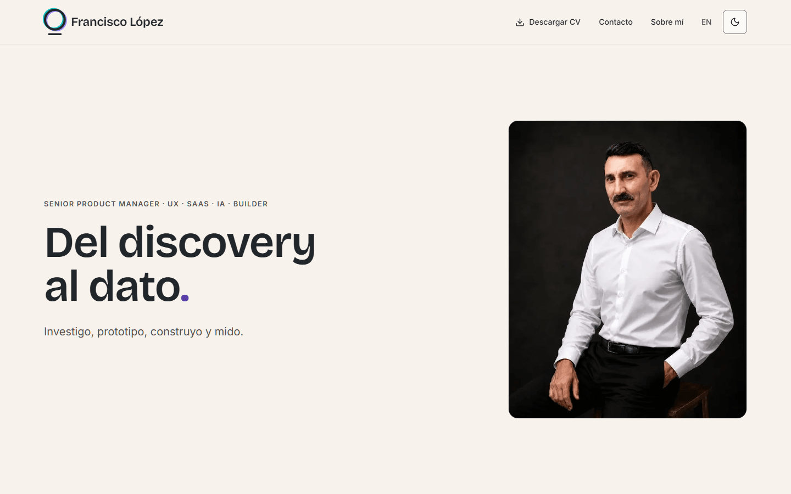
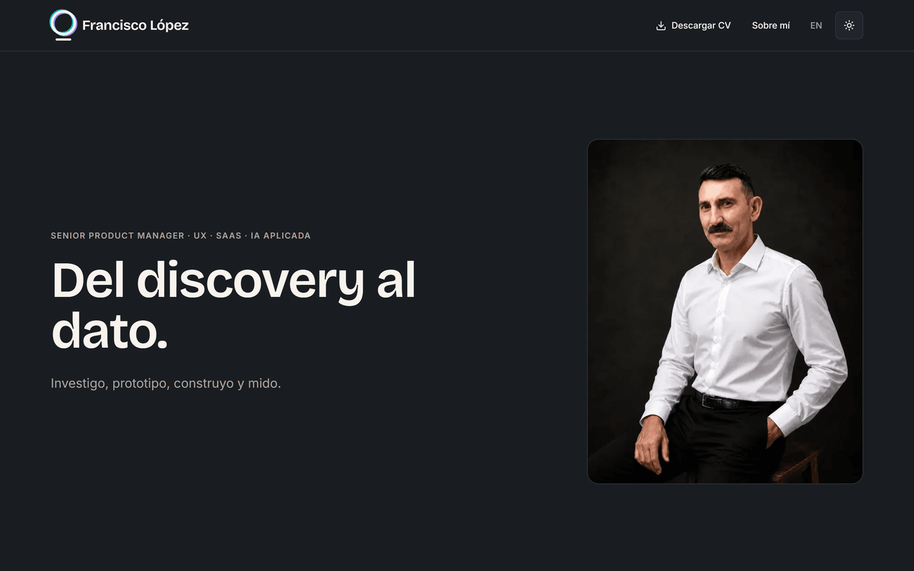

<div align="center">


**Web personal de Francisco López, Senior Product Manager.**
La propia web es la prueba de criterio técnico y de diseño: rápida, accesible, bilingüe y con un sistema de marca propio.

[](https://franciscolopez.es)
[](https://github.com/franciscoylopez/francisco-lopez-website/actions/workflows/ci.yml)


[Ver el sitio](https://franciscolopez.es) · [Design System](https://franciscolopez.es/design-system) · [Brand Kit](https://franciscolopez.es/brand-kit) · [Accesibilidad](https://franciscolopez.es/accesibilidad) · [Un deep-dive](https://franciscolopez.es/trayectoria/emendu)

</div>

---

## El sitio

Catorce páginas por idioma, en español (raíz `/`) e inglés (`/en`). Tema claro y oscuro, `system` por defecto.

| Claro | Oscuro |
| :---: | :---: |
|  |  |

## Qué tiene de interesante

No es un portfolio con un `README` de portfolio. Lo que hay debajo son unas cuantas decisiones que se sostienen solas, cada una con su registro fechado en [`DECISIONS.md`](./DECISIONS.md):

| | Decisión | Por qué está aquí |
| :-- | :-- | :-- |
| **Un dato, un sitio** | De una experiencia, la frase de la portada, el bullet del CV y su gemelo del deep-dive son **el mismo elemento de un array** | Vivían en tres archivos y habían divergido ocho veces. Una fecha equivocada no falla donde se escribe: falla en los seis sitios que la leen · `D57` · `D58` |
| **La accesibilidad se hereda** | `text-muted-foreground` no significa «este gris», significa «el atenuado del fondo donde caiga este texto» | Cada superficie recalcula su propio contraste. 141 usos heredaron el arreglo sin tocar un solo call site, y una tarjeta nueva nace bien sin pedirlo · `D39` · `D61` |
| **Nada se escribe a mano** | Ocho piezas resuelven todo lo accionable, los rótulos, las cabeceras, las tablas y las cajas | Si un caso no encaja en una variante, se crea la variante. Es lo que hace que un cambio de hover llegue a todas las páginas a la vez · `D36` |
| **Los guardianes buscan la ausencia** | Los checks de CI no comprueban que las copias conocidas cuadren: comprueban que **no queda ninguna** | Un metro que solo valida lo que ya conoce aprueba sobre lista vacía. Y cada uno **afirma cuánto ha mirado** · `D38` · `D54` · `D63` |
| **El refactor se demuestra** | `npm run gate:html` compara el HTML servido de todas las variantes antes y después | Diff vacío = transparente por construcción, no por revisión. Es lo que más ha cazado, y se valida rompiéndolo · `D42` · `D45` |
| **Un artefacto se enseña** | El diagrama del deep-dive es el render **real** de su Mermaid original, saneado y en línea | Redibujarlo con los tokens del sitio cumplía la letra de la regla e incumplía su espíritu. En línea, y no como imagen, para que conmute con el tema · `D54` |
| **El alto también es un eje** | El gate de accesibilidad se dispara dos veces: *mientras se dibuja* una banda y *al cerrar* | Un 1920 con el escalado de Windows al 150% es un viewport de 1280×618. No lo vio ninguna auditoría porque ninguna miraba una combinación que el desarrollador no tiene delante · `D50` · `D52` |
| **Un vídeo entra con facade** | Hasta que alguien pulsa no hay iframe, ni JS de terceros, ni una petición a Google | El clic es más estricto que gatearlo por categoría: quien acepta todas las cookies tampoco carga YouTube sin pulsar · `D55` |

## Stack

- **Next.js 16** (App Router, Turbopack) · **TypeScript** (`strict`) · **Tailwind CSS v4**
- **Capa de componentes propia, con un núcleo de ocho piezas** — `action` (todo lo accionable) · `chrome` (enlaces de navegación) · `badge` (rótulos que no se pulsan) · `heading` (eyebrow + titular) · `field` (el campo de formulario) · `table` · `stat-row` · `layout`. Aparte, no como novena pieza del núcleo: la capa de **artículo largo** que usa «Cómo se ha creado esta página» (`D76`), que se vacía por su propio criterio — cuando una segunda página quiere una de sus piezas, esa pieza sale, y vuelve si su motivo no valía en las cuatro (`D113`, `D121`, `D123`). El inventario completo de `components/ui/` se **deriva del disco** en [`components/ui/README.md`](./components/ui/README.md) (`npm run indices`). **shadcn/ui** está configurado (estilo `base-nova`) y **sin usar**: en un widget con foco atrapado se pregunta antes por la plataforma (`<dialog>`, `popover`, `anchor-name`), y shadcn entra donde ella no llega (`D6`, `D36`)
- **lucide-react** para iconos; los que lucide no trae se dibujan a mano con su propia regla de autoría, para que no se distingan de los de la librería
- **next-themes** (claro/oscuro, `system` por defecto) · **Vercel** (`main` = producción)

## Características

<details>
<summary><b>i18n, SEO y contenido generado</b></summary>

- **i18n ES/EN** desde la primera línea: español sin prefijo (`/`), inglés en `/en`, diccionarios tipados y cero strings hardcodeados. El diccionario está **partido por página** (`D48`): los tipos salen del ES y una clave que falte en EN rompe el build.
- **SEO técnico**: metadata + `canonical` + `hreflang` por página, `robots.txt` y `sitemap.xml` (gateados por entorno) y datos estructurados JSON-LD (`ProfilePage`/`Person` en la home, `BreadcrumbList` en páginas internas, `WebPage` en el deep-dive).
- **Qué páginas tiene el sitio no se escribe en ningún sitio**: las páginas del deep-dive, el índice, el sitemap, `llms.txt` y las tarjetas OG **derivan** de `content/experiences.ts` (`D44`, `D59`). Estaba escrito a mano en tres sitios.
- **`llms.txt`**: resumen curado para LLMs y agentes, generado desde el diccionario y los datos de contacto.
- **Imágenes Open Graph** de marca generadas al vuelo (`/api/og`, `next/og`).

</details>

<details>
<summary><b>Contacto: la única superficie que recibe</b></summary>

Un formulario de tres campos, y todo lo demás es consecuencia de dos decisiones.

**El envío es una Server Action del mismo origen**, no un endpoint externo: la política de contenido no cambió —`form-action 'self'` y `connect-src 'self'` ya lo permitían— y el formulario **funciona con JavaScript desactivado**, porque el navegador postea el `<form>` igual. Validar al salir de un campo, mover el foco al primer error y el estado «enviando» son comodidad encima de eso, nunca el mecanismo. La validación que decide corre en el servidor y devuelve **códigos, no frases**: las palabras las pone el diccionario, en los dos idiomas.

**Y sale por el SMTP de la propia cuenta**, no por un proveedor transaccional, porque uno externo sería un encargado del tratamiento nuevo que habría que declarar en la página de privacidad. Anti-spam **sin CAPTCHA** —que es una barrera de accesibilidad, y este sitio publica una declaración de conformidad—: campo trampa, filtro de velocidad y tope por IP, los tres con su límite escrito (`D95`).

</details>

<details>
<summary><b>Deep-dive por experiencia</b></summary>

El índice `/trayectoria` y cinco páginas en `/trayectoria/[slug]`, con una plantilla única — Datos · En un minuto · La historia · El caso (opcional) · Aprendizajes — y un presupuesto de 700-900 palabras, 1.200 con caso. La homogeneidad la dan el marco y la longitud, no los títulos: dentro de «La historia» los subapartados son libres, para que una experiencia de tres meses no salga con secciones medio vacías al lado de una de cinco años y medio.

Los **artefactos son documentos reales**, no recreaciones (`D53`, `D54`). Y hay una **línea de discreción**: lo que se cuenta en una entrevista no se escribe en una página pública, y eso acota también el corpus del agente conversacional antes de que exista.

</details>

<details>
<summary><b>Accesibilidad</b></summary>

- **Todos los pares de color del sistema en WCAG AAA**, en ambos temas, **en reposo y en hover**, sobre las catorce páginas × dos temas y con el metro validado en las 28 corridas. La pasada es un comando (`npm run censo`) y lee las páginas del registro, así que una nueva entra sin que nadie se acuerde (`D85`).
- El censo de contraste se hace **recorriendo el DOM de la página servida**, no leyendo el CSS: un par que solo existe al componer un velo, o una pastilla de hover, no aparece en ningún inventario de tokens.
- **Enlace de salto** (WCAG 2.4.1, nivel A), que axe no detecta y por eso se comprueba a mano (`D46`).
- **Probado con lector de pantalla** (NVDA sobre Chrome), no solo con motores de reglas. Es lo que encuentra los defectos que no violan ningún criterio y que por eso ningún escáner ve; los que encontró están publicados en la propia página de Accesibilidad (`D73`).
- `prefers-reduced-motion` **retira lo que desplaza o escala, no lo que se funde** (`D136`): la opacidad y el color se quedan, y el fundido que se queda se acorta. Una animación mixta se parte; solo se apaga entera la que es movimiento de principio a fin, o la que va acoplada al scroll. Y con motion reducido el vídeo de apertura de «Sobre mí» **ni siquiera se descarga** (`D65`).
- El método completo, y los tres metros que este proyecto se ha encontrado descalibrados, en [`BRAND.md`](./BRAND.md) §Accesibilidad.

</details>

<details>
<summary><b>Rendimiento, medición y seguridad</b></summary>

- **PageSpeed >90 en las catorce páginas** — móvil 95-99 · escritorio 97-100, medido el 2026-08-24 (`npm run psi -- --registro`) — y CLS 0. Server Components por defecto, responsive en CSS y JS de cliente solo en las islas interactivas.
- **Analítica y consentimiento**: Google Tag Manager + GA4 y **Microsoft Clarity**, con **Consent Mode v2** y banner de consentimiento granular (RGPD), con página propia de privacidad y cookies. Todo gateado a producción **y** a consentimiento: nada mide sin él.
- **CV en PDF bilingüe** (ES/EN) generado por código, con identidad de marca y texto seleccionable (ATS).
- **Un gesto de marca, y solo uno** (`D137`): el punto final de «Del discovery al dato.» cae y se asienta al cargar, en morado, con dos curvas porque lo que cae acelera. Es la **firma**; el filete que crece bajo los años de Hitos es su **textura**, subordinada a propósito. Se eligieron viéndolos, no razonándolos.
- **Cabeceras de seguridad**: nosniff, X-Frame-Options, Referrer-Policy, Permissions-Policy, HSTS y **CSP** con allowlist mínima por origen exacto. La letra que le pone cada escáner no se escribe aquí: se comprueba en vivo, y por qué no sube está en `DECISIONS.md` D26.
- **Páginas de error 404 y 500** con marca e i18n: el 404 convierte el «0» en el círculo del split, que florece al cargar. Puro CSS, y con motion reducido **sigue floreciendo, en 0,2 s en vez de 0,9**: es opacidad de principio a fin, así que no hay nada vestibular que retirar (`D136`).

</details>

## Que no se rompa

Los pasos de CI de cada PR se leen en [GitHub Actions](./.github/workflows/ci.yml), que es donde no pueden mentir, y `main` está protegida por ruleset: no hay push directo, y un PR no mergea con CI en rojo.

| Paso | Qué impide |
| :-- | :-- |
| `format:check` · `typecheck` · `lint` | Lo de siempre. Nada que no compile entra en `main` — y desde `D147` el `lint` cubre también `scripts/`, que es el 30% del código y no lo miraba nadie |
| `check:palette` | Dos cosas: que quede **ninguna** copia de un valor de token fuera de su fuente —busca valores, no patrones (`D38`)— y que no haya aparecido ningún color, superficie o animación que el censo de contraste no haya visto. Medir necesita navegador; comprobar si hay que medir, no (`D90`) |
| `check:experiencias` | Que las tres longitudes de una experiencia se descuadren: misma cobertura en ES y EN, y ninguna cifra en una y no en la otra (`D57`) |
| `check:cv` | Que los PDFs commiteados se queden viejos. Sella la **huella de las entradas**, no bytes: el PDF no es determinista (`D60`) |
| `check:raya` | Que vuelva la raya (`—`) al copy servido, con sus dos excepciones (`D63`) |
| `check:artefacto` | Que el SVG commiteado se quede viejo. Sella el **par fuente→producto**, que es más fuerte que sellar entradas: aquí sí se pudo, porque el artefacto **es** determinista (`D70`) |
| `check:contexto` | Que el contexto de arranque crezca sin techo. D28 escribió el régimen y no le puso cifra: creció un 113% en diez días (`D69`) |
| `check:skills` | Que una skill nombre archivos o comandos que ya no existen. Se **siguen** en vez de leerse, así que su drift se ejecuta (`D60`) |
| `check:indices` | Que un índice deje de ser el derivado de sus fuentes. Son cuatro y se generan con `npm run indices` (`D69`); el cuarto indexa una carpeta —`components/ui/`— y además comprueba que cada pieza salga de verdad en la sección que dice publicarla (`D89`) |
| `check:excepciones` | Que la lista de controles escritos a mano de `BRAND.md` se lleve de memoria. Era la última que quedaba así, y al derivarla del disco estaba mal por los dos lados: nombraba una que no lo era y le faltaba otra, escrita tres veces. Cada control fuera de la capa lleva su marca `@fuera-de-capa` y el documento tiene que nombrarlo (`D109`) |
| `check:articulo` | Que «Cómo se ha creado esta página» describa un proyecto que ya se ha movido. Cada sección declara de qué depende y lleva su sello: cuando una fuente cambia, CI sale rojo **nombrando la sección** (`D84`) |
| `check:accesibilidad` | Que `/accesibilidad` siga diciendo la verdad. Publica el mismo tipo de afirmación que el artículo y no tenía nada: la frase «aún no hay formulario» sobrevivió tres días al sprint que lo construyó, y se encontró de casualidad leyendo la página. Sus cinco bloques verificables declaran de qué dependen y llevan sello, y las dos cifras del arnés que escribe en prosa se comparan con los casos que hay (`D140`) |
| `check:og` | Que la tarjeta que se ve al compartir el sitio diga otra cosa que la página. Sus dieciséis cadenas repetían copy del diccionario y nada las comparaba: al afilar el kicker del Hero, cambiarlo eran **tres** sitios y el tercero solo apareció por un `grep` a mano. La divergencia deliberada se declara con su motivo — y el gate exige que **siga** divergiendo (`D142`) |
| `check:rutas` | Que «qué páginas tiene el sitio» vuelva a estar escrito en cuatro listas. Contrasta el registro contra `app/[lang]/**/page.tsx`, y `pageMetadata` pide el tipo derivado: olvidar una página no compila (`D72`) |
| `check:marco` | Que una página nueva salga sin enlace de salto, sin su `h1`, sin breadcrumb o con la metadata de otra. Mide el HTML **prerenderizado**, no el código: los helpers son opt-in, y escribirse la metadata a mano compila igual. De paso resuelve las referencias `@id` del JSON-LD, que ningún validador externo comprueba (`D75`) |
| `check:figuras` | Que una figura pinte sus rótulos ilegibles. `text-[11px]` dentro de un `viewBox` son 11 **unidades de dibujo**, no 11 píxeles, y esa escala no está en el `font-size` computado: los diagramas del artículo pintaron entre 5,0 y 8,2px durante meses sin que lo viera nadie. Mide el prerender, así que no necesita navegador (`D106`) |
| `check:kit` | Que un asset del kit de marca entre sin que nadie lo cuente, **y que los binarios no estén vacíos**. El ZIP se genera en el build leyendo el directorio, así que **no puede caducar**; lo que sí deriva es el registro, y así aparecieron diez huérfanos que nunca tuvieron tarjeta: nadie los metió a propósito, simplemente no había nada que los contara. Desde el 2026-08-30 abre además cada PNG y el `.ico`: formato, medida declarada y cobertura de tinta (`D119`) |
| `check:marcas` | Que un nombre propio se publique traducible. El traductor automático de Chrome convierte «TheTool» en «La Herramienta», y esta web es bilingüe: la traducción se ofrece de verdad. El atributo lo pone una capa y el copy no lo escribe, así que el gate comprueba que **llegó** — busca la ausencia sobre cada nodo de texto, no cuenta cuántos hay (`D116`) |
| `check:guardianes` | Que un guardián pierda los dientes **en silencio**. A cada uno de los otros le pasa un caso malo conocido y comprueba que lo rechaza: es un test de que sabe fallar, no de que funciona (`D70`) |
| `test` | Que la lógica del formulario se rompa sin que nadie se entere: validación, saneado de cabeceras del correo y decisiones de la Server Action. Vitest, sin DOM falso, y midiendo el mensaje que nodemailer **emite** en vez del objeto que recibe (`D101`) |
| `build` | — |

Y fuera de CI quedan los que necesitan algo que un runner no tiene. El que más ha cazado es **`npm run gate:html`**: compara el HTML servido de todas las páginas × dos idiomas antes y después de un refactor, y ahí vive lo que nadie revisa —un `hreflang` mal copiado no lo ve el typecheck, ni el linter, ni axe—. **`npm run censo`** y **`npm run pliegue`** necesitan un navegador de verdad —el segundo comprueba que las aperturas que comparten pliegue midan lo mismo, una invariante que se rompió tres veces y siempre la vio un ojo (`D144`)—; **`npm run psi`** y **`npm run check:enlaces`** necesitan red, y el segundo no puede ser gate de CI por la misma razón que el primero: un servidor ajeno caído cinco minutos daría un rojo que no es nuestro (`D141`). **`npm run check:tablero`** necesita el MCP de Notion. Los cuatro últimos tienen su criterio probado aparte, en `npm test`, para que vivir fuera de CI no lo deje sin red (`D107`).

## Arrancar

```bash
npm install
npm run dev        # http://localhost:3000
```

<details>
<summary><b>Todos los scripts</b></summary>

```bash
npm run build      # build de producción
npm run start      # sirve el build de producción
npm run lint       # ESLint
npm run typecheck  # tsc --noEmit
npm run format     # Prettier
npm test           # Vitest, una vez (npm run test:watch para el bucle)

# Guardianes (los mismos que corre CI)
npm run check:palette       # la paleta del código contra la de globals.css, y que no
                            # quede ninguna copia de un token fuera de su fuente (D38)
npm run check:experiencias  # que las TRES longitudes de cada experiencia cuadren (D57)
npm run check:cv            # que los PDFs commiteados correspondan a su fuente (D60)
npm run check:raya          # que no vuelva la raya (—) al copy servido (D63)
npm run check:marco         # el criterio de cierre de página, sobre todas las variantes
                            # prerenderizadas: axe, enlace de salto y JSON-LD (D75).
                            # Necesita `npm run build` antes: mide el HTML, no el código
npm run check:figuras       # el rótulo PINTADO de cada figura con lienzo escalado, contra
                            # el suelo de 11px de la DoD (D106). También sobre el prerender
npm run check:marcas        # que los nombres propios lleguen al HTML con translate="no",
                            # o el traductor de Chrome los destroza (D116). Prerender también
npm run check:kit           # que el registro del kit de marca y public/logo-kit/ cuadren en
                            # los dos sentidos, y que los binarios no estén vacíos (D119).
                            # El ZIP no se vigila: se hace al build leyendo el directorio
npm run check:accesibilidad # que /accesibilidad siga siendo cierta: sus cinco bloques con
                            # fuente sellada, y las cifras del arnés contra los casos (D140)
npm run check:og            # que cada tarjeta OG diga lo que su página, en los dos idiomas,
                            # salvo lo declarado distinto con su motivo (D142)

# Generadores
npm run cv         # regenera el CV en PDF (ES + EN) → public/cv/ y actualiza su sello
npm run artefacto  # re-renderiza el diagrama de Emendu desde su .mmd (D54)

# Medición
npm run gate:html -- save   # instantánea del HTML de todas las páginas × 2 idiomas
npm run gate:html           # …y comprueba que un refactor no lo cambió (D42, D45)
npm run pliegue             # que las aperturas que comparten pliegue midan lo mismo (D144).
                            # Necesita el sitio servido y agent-browser
npm run check:enlaces       # que las URLs externas del sitio sigan respondiendo (D141)
npm run novedades           # qué secciones publicadas toca este PR, y si es copy o solo
                            # una fuente que se movió (D143). Lo lanza CI en cada PR
npm run articulo:novedades  # QUÉ cambió en cada dependencia del artículo desde el sello
                            # vigente, con las de solo comentarios marcadas (D103).
                            # Se invoca PORQUE check:articulo está en rojo
npm run psi -- <url>        # PageSpeed de UNA página: nota, métricas y desglose del LCP (D49)
npm run psi -- --registro   # …y de todas las del registro, con el agregado de avisos (D99).
                            # Al terminar SELLA el rango en content/psi/ y el artículo lo
                            # publica con su fecha; una pasada parcial no sella (D102)
npm run censo               # censo de contraste: todas las páginas × 2 temas, servidas (D85)
npm run check:tablero       # que Prioridad siga siendo un orden, sobre un volcado del
                            # tablero de Notion. Al empezar la sesión, no en CI (D107)
qlty smells --upstream main # los hallazgos que el PR cuenta, en local (D86)
```

> **`qlty smells`** necesita el [CLI de qlty](https://qlty.sh) instalado. El check del PR
> publica un número y su detalle vive tras un login, así que el mismo argumento por el que
> `.qlty/qlty.toml` está versionado aplica al informe: `--upstream main` reproduce en local
> exactamente lo que el PR cuenta.

> **`npm run artefacto`** usa `@mermaid-js/mermaid-cli`, que necesita un navegador.
> `scripts/mermaid-puppeteer.json` declara `channel: "chrome"`, o sea **el Chrome que ya
> tengas instalado**: no se descarga ningún Chromium. El render es local — el diagrama no
> sale a ningún servidor — y **determinista**, así que regenerar sin cambiar el `.mmd` no
> ensucia el diff.

> **`npm run censo`** necesita el sitio **servido** (`npm run build && npm start`) y
> `agent-browser`: la mitad de los pares de este sitio no existen hasta que el navegador
> compone un `color-mix`, así que no hay forma estática de verlos. Lee las páginas del
> registro, valida el metro en cada corrida y falla si aparece un par bajo AAA. Fuera de CI
> por la misma razón que `psi`.

> **`npm run psi`** necesita una **URL pública** (el Preview de Vercel o producción, nunca
> localhost) y una clave gratuita de la API en `PSI_API_KEY` — ver [`.env.example`](./.env.example).
> Imprime la nota, las métricas, el **desglose del LCP por fases** y los avisos que no pasan.
> La primera línea es la **huella del despliegue**: si no cambió tras un push, estás midiendo
> el build anterior.

> El **gate de HTML** necesita el sitio servido (`npm run build && npm start`), y la línea
> base y la comprobación tienen que salir del mismo modo: dev y prod emiten HTML distinto.
> `BASE_URL` cambia el puerto.

> **Lighthouse/PageSpeed** se mide contra el build de producción, nunca contra `next dev`.

</details>

## Estructura

<details>
<summary><b>Mapa del repositorio</b></summary>

```
app/[lang]/            Rutas por locale (home, sobre-mi, trayectoria + trayectoria/[slug], brand-kit,
                       design-system, accesibilidad, cookies) + layout y error boundary
app/[lang]/dictionaries/{es,en}/  Diccionario PARTIDO POR PÁGINA (D48): common + una rama por página.
                       Cada página carga la suya; los tipos salen del ES y una clave que falte en EN
                       rompe el build
app/api/og/            Generación de imágenes OG (ImageResponse)
app/{robots,sitemap}   Metadata routes (robots.txt, sitemap.xml)
app/llms.txt/          Route handler: /llms.txt generado desde el diccionario i18n
app/global-*           404/500 de marca e i18n (global-not-found, global-error)

components/ui/         Primitivas SIN conocimiento del contenido. QUÉ HAY DENTRO no se escribe
                       aquí: components/ui/README.md lo deriva del disco con `npm run indices`
                       y check:indices lo comprueba en cada PR (D89). Esta lista SÍ estaba
                       escrita a mano, y para agosto de 2026 le faltaban 9 de 21 piezas
components/site/       Piezas que SÍ saben de este sitio: page-shell.tsx (el marco común de toda
                       página: JSON-LD, nav, isla de motion, el <main> y footer, D45/D46),
                       system-page-opening.tsx (la apertura compartida de las tres páginas que
                       documentan el sistema, donde vive la invariante del pliegue, D156),
                       skip-link.tsx (WCAG 2.4.1 nivel A), bloques (nav, footer, breadcrumb,
                       banner de cookies…) y secciones de página (hero, hitos, toolkit…)
components/site/{design-system,brand-kit}/  Los dos showcase, UN ARCHIVO POR SECCIÓN (D42)
components/site/diagrams/  Los diagramas SVG del sitio y lo que comparten: shared.tsx (el rótulo,
                       el realce y el conmutador de dos lienzos de D68.59). Salió de la carpeta del
                       artículo cuando /accesibilidad estrenó el suyo (D112)
components/site/como-se-ha-creado-diagrams/  Los ocho del artículo, UN ARCHIVO POR DIAGRAMA
components/analytics/  GTM + Consent Mode (init)

content/               Contenido y datos que NO son copy del diccionario: cv/ (lo exclusivo del papel)
                       y experiences.ts (logo y slug por experiencia, unidos por `company`, D44)
content/experience-copy/  De una experiencia, TODO lo que se cuenta en más de una superficie.
                       Home, CV, deep-dive y llms.txt leen de aquí (D57, D58)
content/artefactos/    El `.mmd` es la FUENTE del dibujo y el `.svg` de al lado su render saneado:
                       se regenera, no se edita (D54)
content/articulo/      Lo que el artículo declara de sí mismo: dependencias.ts (de qué depende
                       cada sección, D84), su sello, y ci-steps.ts (los pasos que dibuja §s10,
                       comparados contra el workflow en cada PR, D102)
content/psi/           registro.json: el rango de PageSpeed con su fecha, escrito por
                       `npm run psi -- --registro`. El artículo lo publica de ahí (D102)

lib/                   i18n (fuente única de ruta↔locale), page-meta (D45), site (SITE_URL),
                       contact, analítica, consentimiento, datos estructurados, design-values
                       (fuente única de lo que el sitio publica sobre sí mismo, D38), figures
                       (las cifras del artículo, derivadas del disco o selladas, D102) y utils
proxy.ts               Enrutado de locale (Next 16 renombra middleware → proxy)
public/                Assets: logo-kit, cv, img, og, video, favicons
brand-assets/          Piezas de marca fuera de la web — no se despliega

scripts/logo-kit/      Generación del kit de logo desde su geometría
scripts/cv/            Generador del CV en PDF (react-pdf) + facts.ts
scripts/check-*.ts         Los guardianes de CI. Todos comparten dos reglas de método:
                           buscan la AUSENCIA (no el patrón) y afirman cuánto han mirado
scripts/indices.ts         Genera los índices de markdown derivados de sus cabeceras (D69)
scripts/inventario.ts      El inventario de components/ui/ y la política de qué se publica
scripts/check-guardianes.ts  Un caso malo conocido por guardián. Muta archivos para
                           provocar el fallo, así que exige árbol limpio y restaura (D70)
scripts/design-review/     Censo de pares de contraste del DOM servido
scripts/psi.ts             PageSpeed desde la terminal: una página con su desglose del LCP,
                           o el registro entero con el agregado de avisos (D49, D99)
scripts/page-html-diff.ts  Gate de refactor: el HTML servido de las páginas del registro,
                           en sus dos idiomas, no puede cambiar
scripts/artefacto-svg.ts   Traductor del export de Mermaid al SVG que el sitio sirve. Aborta si
                           queda UN solo color literal: busca la ausencia (D54)

.github/workflows/     ci.yml, el gate de calidad de cada PR · dependabot-automerge.yml, que
                       decide quién CIERRA los PR de dependencias (D92)
.github/dependabot.yml Escaneo de dependencias: PRs semanales (npm + github-actions).
                       Controla cuántos se abren; la otra mitad es el workflow de arriba
.claude/skills/        Skills del proyecto: update-cv, deep-dive-page,
                       publicar-en-design-system (una pieza nueva se publica, `D89`) y
                       gates-de-servidor (los tres gates que necesitan el sitio servido).
                       Y las tres revisiones recurrentes — sprint-review (el codebase, al
                       cerrar etapa), method-review (cómo se trabaja, entre sprints) y
                       design-review (el diseño, en pantalla). close-session cierra la
                       documentación.
.claude/agents/        Subagentes: viewport-verifier (mide una página servida con agent-browser;
                       mide y reporta, no edita, D52)
```

</details>

## Documentación

El «porqué» vive en documentos dedicados, partidos por una regla que **no es de estilo sino de coste**: lo que se lee en cada sesión de trabajo se paga en cada sesión de trabajo. Así que solo las **reglas activas** están siempre delante; la **historia** y el **detalle exhaustivo** se consultan cuando hacen falta.

**Siempre cargados.** Son las reglas que aplican al escribir código, y su peso conjunto tiene techo medido en CI (`npm run check:contexto`): si crecen, el build falla. La salida por defecto es **retirar**. El techo subió una sola vez, el 2026-08-25, con la holgura de trabajo en dos palabras y atado a que apareciera un dato — un techo que no deja escribir no produce compactación, produce el reflejo de subirlo. El dato llegó el 2026-08-27: **el crecimiento no venía de un archivo gordo sino de lluvia fina sobre los tres**, y el porqué de cada regla estaba escrito dos veces. El techo volvió a bajar detrás. Y el mismo guardián pone ahora techo a la **suma de las skills**, que es lo que impide que retirar de un documento sea mudarlo.

| Documento | Qué contiene |
| :-- | :-- |
| [CLAUDE.md](./CLAUDE.md) | Convenciones de código (i18n, tokens, a11y, SEO), la regla de construcción y la **Definition of Done** por sección |
| [BRAND.md](./BRAND.md) | Sistema de marca: reglas siempre activas (color, tipografía, tokens, a11y) |
| [PRD-Live.md](./PRD-Live.md) | Spec viva: qué es el producto **hoy** y qué tiene que cumplir |
| [AGENTS.md](./AGENTS.md) | Aviso: este Next tiene breaking changes; leer los docs del paquete antes de tocar APIs |

**A demanda, con índice.** Aquí vive el porqué completo: qué se probó, qué se descartó y qué falló antes de que cada regla quedara escrita. No se cargan nunca enteros, y por eso **todos llevan índice derivado de sus propias cabeceras** — un archivo de 46.000 palabras sin índice es inservible, y con índice está bien. Los genera `npm run indices` y los vigila `check:indices`: no se escriben a mano, así que no pueden mentir sobre lo que hay dentro.

| Documento | Qué contiene | Su índice |
| :-- | :-- | :-- |
| [DECISIONS.md](./DECISIONS.md) | Las decisiones técnicas del build (ADR-lite), numeradas y fechadas | En `CLAUDE.md`: se lo gana, porque el código las cita por número |
| [PRD-Historical.md](./PRD-Historical.md) | Registro fechado de decisiones de producto, diseño y alcance | En su cabecera |
| [BRAND-historical.md](./BRAND-historical.md) | El porqué fechado de las reglas de marca | En su cabecera |
| [CLAUDE-historical.md](./CLAUDE-historical.md) | El caso que escribió cada convención: qué falló para que la regla exista | En su cabecera |

**Y dos que no son ninguna de las dos cosas:** [BRAND-logo.md](./BRAND-logo.md), la enciclopedia del logo y la firma split, y [LICENSE](./LICENSE) — público para consulta, no código abierto: todos los derechos reservados.

**Nada tiene copia en otro sitio.** El repositorio es la única fuente de la documentación: no hay espejos, y los índices se derivan en vez de escribirse. Es la misma regla que gobierna el código de este sitio —una cosa, un sitio— aplicada a lo que se dice sobre él, y por el mismo motivo: *la misma cosa escrita en dos sitios acaba diciendo dos cosas.*

## Despliegue

Vercel, con **previews por rama y por PR**, y `main` = producción ([franciscolopez.es](https://franciscolopez.es)).
Flujo: ramas cortas → PR → merge (squash si trae un commit, rebase si trae varios) → tag `vX.Y.Z` por release.

---

<div align="center">

**Francisco López** · Senior Product Manager
[franciscolopez.es](https://franciscolopez.es) · [LinkedIn](https://linkedin.com/in/franciscolopez1975)

<sub>Repositorio <b>público para consulta</b>, no de código abierto: <a href="./LICENSE">todos los derechos reservados</a>.<br>
El código está a la vista para que se pueda examinar. ¿Quieres reutilizar algo? Escribe.</sub>

</div>
